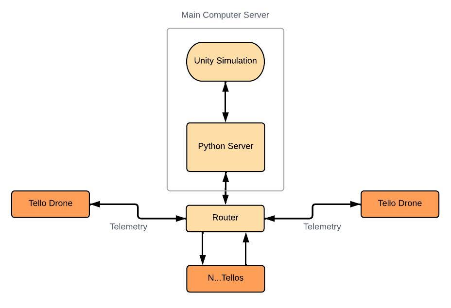
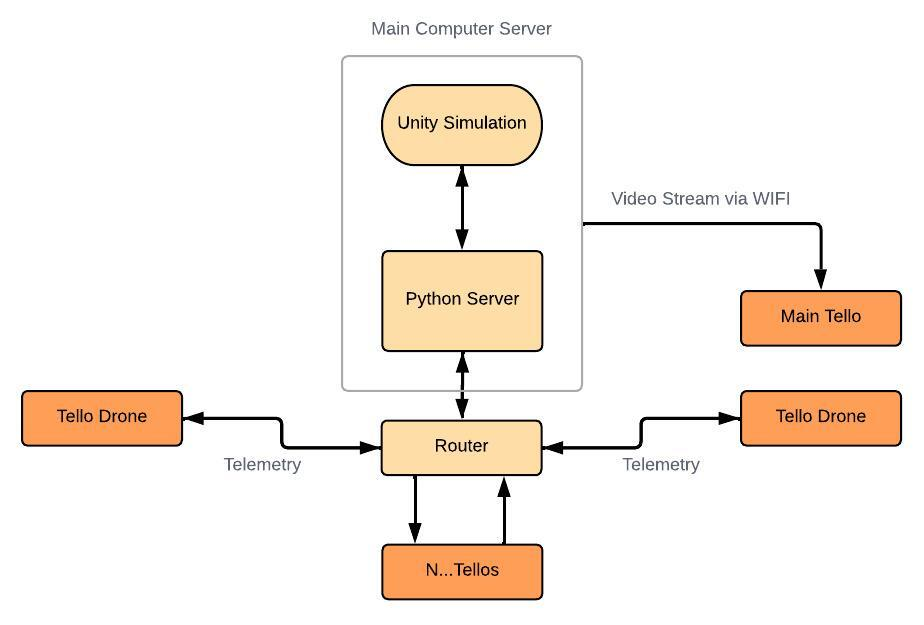

# Autonomous Swarm

Simulates Search and Rescue Mission using 5 Tello EDU drones (Can have a variable number of drones).

1. [Overview](#overview)
2. [Architecture](#architecture)
3. [Requirements](#requirements)
4. [Procedure](#user-inputs-and-procedure)
5. [TroubleShooting](#troubleshooting)
6. [External Projects](#external-projects)

# Overview

Fly multiple Tello EDU drones in a specific SWARM Formation in search for mission pads. Tello drones will takeoff and calibrate. Afterwhich, the drones will begin to fly forward and comb the area in search of the mission pad provided with the Tello EDU. Upon finding mission pad drone will land. The remaining drones will adopt another formation to cover for the drone that has landed.

This will continue until all the mission pads have been found. If a Tello drone loses its status or lands early, the remaining drones will cover and change formation. 

# Architecture
The drones communicate using UDP based off of the Tello SDK. There are two possible Swarm Scenarios. Refer to SDK on Tellos Communication Protocol. 

**UNITY SIMULATION IS OPTIONAL**

>**No Video**
>- Tello Drones are in AP Mode (refer to SDK) and are connected to the same Router
>- The Tello IP addresses are the ones given from the Router using DHCP not manual IP
>- Communication is handled directly from the Computer and all the Tello drones
> 
>

>Video
>- Main Tello is in WIFI Mode while the rest are in AP Mode (refer to SDK) and are connected to the same Router which is connected to the same computer
>- The Main Tello is connected directly to the computer via WIFI
>- If Video is required for the different 
> 
>

# Requirements

> - Python 3.8.0
> - OpenCV 4.7.0 
> - TensorFlow
> - cvzone
> - Tello Firmware v02.05.01.19 (Some capabilites cannot be used with different versions)

# User Inputs and Procedure

### Pre-Checks
> Ensure the VideoStreamConfiguration.yaml file is up to date with the Tello IP addresses and details.

### Run Program
> **NO UNITY**
> 1. On all the drones and ensure they are blinking yellow and connected to the Router via the router admin page
> 2. Ensure Computer is connected to the same router 
> 3. Execute <TelloClient.py --standalone> to run using Router/WIFI (if connected using the wifi, video stream will run, if not there will be no video stream) 
>
> **UNITY**
> (Will not execute Search and Recue, NON AUTONOMOUS SWARM)
> 1. On all the drones and ensure they are blinking yellow and connected to the Router via the router admin page
> 2. Ensure Computer is connected to the same router 
> 3. Execute <TelloClient.py --server --standalone> to run using Router/WIFI (if connected using the wifi, video stream will run, if not there will be no video stream) 
> 4. Execute <SwarmServer.py> to connect to UNITY

### Start Swarm

> [start] - Will kick off the Swarm. Prior to this all drones should have connected and would display on the Terminal, along with the battery

### Emergency Landing
> [n] - n = index of drone to emergency land

### Toggle Face Tracking Mode
> [AI] - Will on the Face Tracking Mode
> 
> [NAI] - Will off the Face Tracking Mode

# TroubleShooting

# External Projects

This Repository uses code based from a few different repositories.

> - DJITelloPy https://github.com/damiafuentes/DJITelloPy/tree/master
> - Tello Programming https://tello.oneoffcoder.com/swarm.html
> - Tello SDK https://dl-cdn.ryzerobotics.com/downloads/Tello/Tello%20SDK%202.0%20User%20Guide.pdf