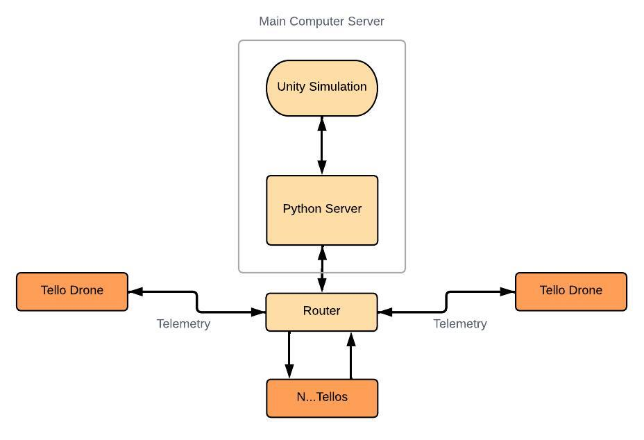
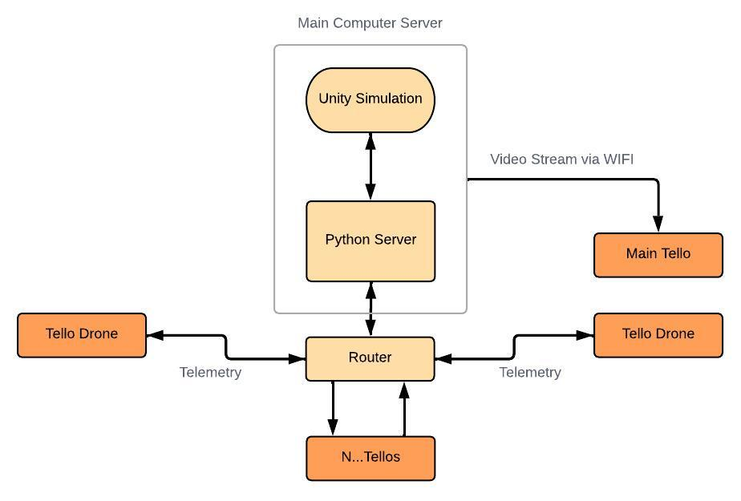
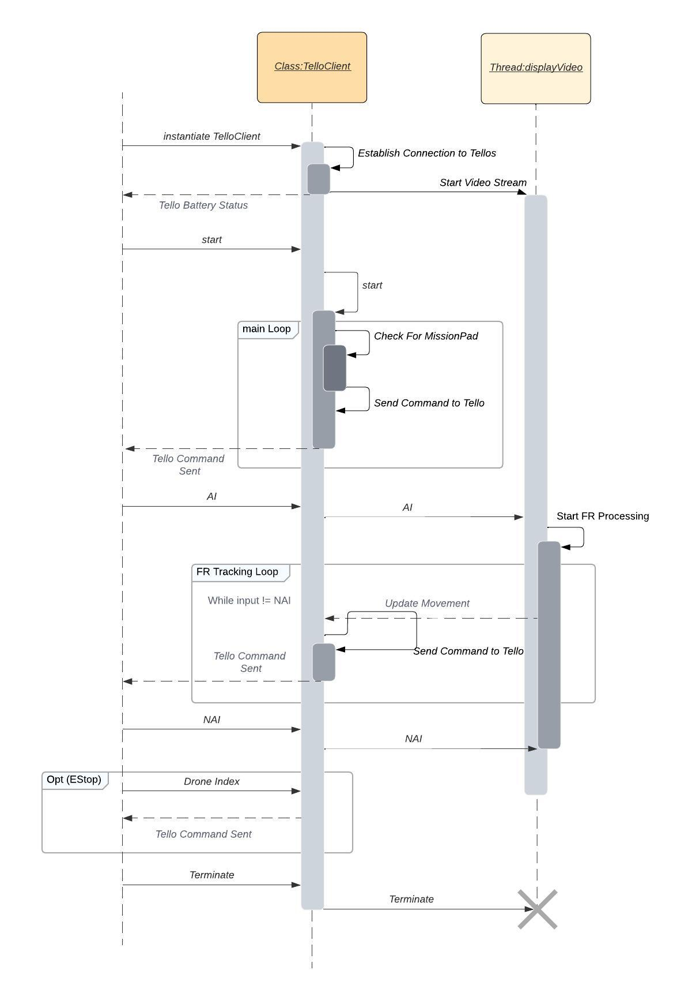
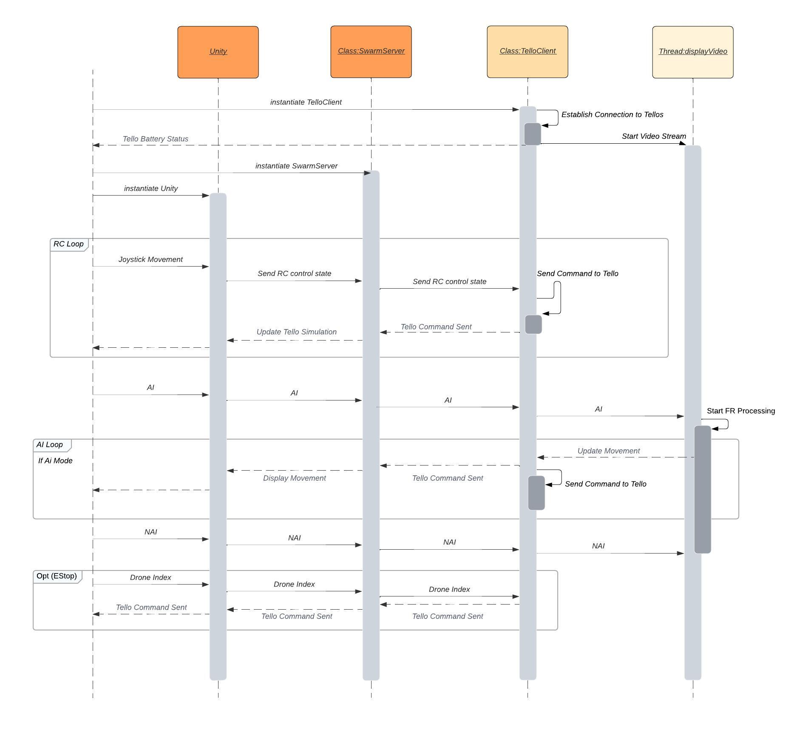
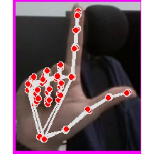
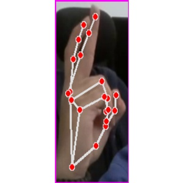

# Tello Digital Twin

Simulates Search and Rescue Mission using 5 Tello EDU drones (Can have a variable number of drones).

1. [Overview](#overview)
2. [Requirements](#requirements)
3. [Architecture](#architecture)
4. [Code Structure](#code-structure)
5. [FR and Gesture Control](#face-tracking-and-gesture-control)
6. [Procedure](#user-inputs-and-procedure)
7. [TroubleShooting](#troubleshooting)
8. [External Tools](#external-tools)

# Overview

Fly multiple Tello EDU drones in a specific SWARM Formation in search for mission pads. Tello drones will takeoff and calibrate. Afterwhich, the drones will begin to fly forward and comb the area in search of the mission pad provided with the Tello EDU. Upon finding mission pad drone will land. The remaining drones will adopt another formation to cover for the drone that has landed.

This will continue until all the mission pads have been found. If a Tello drone loses its status or lands early, the remaining drones will cover and change formation. 

# Requirements

> - Python 3.8.0
> - OpenCV 4.7.0 
> - TensorFlow
> - cvzone
> - Tello Firmware v02.05.01.19 (Some capabilites cannot be used with different versions)

# Architecture
The drones communicate using UDP based off of the Tello SDK. There are two possible Swarm Scenarios. Refer to SDK on Tellos Communication Protocol. 

>**UNITY SIMULATION IS OPTIONAL**

**No Video**
- Tello Drones are in AP Mode (refer to SDK) and are connected to the same Router
- The Tello IP addresses are the ones given from the Router using DHCP not manual IP
- Communication is handled directly from the Computer and all the Tello drones
 

Video
- Main Tello is in WIFI Mode while the rest are in AP Mode (refer to SDK) and are connected to the same Router which is connected to the same computer
- The Main Tello is connected directly to the computer via WIFI
- If Video is required for the different 
 

# Code Structure

The overall Code is designated to two main files, the SwarmServer.py and TelloClient.py. The SwarmServer handles the communications with the Unity Project if any while the TelloClient handles the communication with the Tellos.

**NO UNITY**
- No SwarmServer and UdpComms used
- Main function Thread within the Tello Class handles the commands read either from a file, user input or AI determined movement
- DisplayVideo function Thread within the Tello Class handles the video processing from the Tello drone
- The TelloTools.py handles the direct communication with the drone and is used as a tool classs within the TelloClient Class

> Tools Scripts are not shown

**UNITY**
- Does not Contain Autonomous Swarm Capability
- Has RC and digital Twin capabilities
- Swarm Server uses UdpComms to communicate with the Unity Project and forwards the data between the multiple TelloClients and the single Unity Project
- Main function Thread within the Tello Class handles the commands received from the Swarm Server or AI determined movement
- Meant to use Tello Client per Raspberry PI used for drone
- DisplayVideo function Thread within the Tello Class handles the video processing from the Tello drone
- The TelloTools.py handles the direct communication with the drone and is used as a tool classs within the TelloClient Class

> Tools Scripts are not shown

# Face Tracking and Gesture Control
Current implementation focuses on using simple mathematics to follow a face and land when the required Gesture is displayed

- Launch the drone through the command line using `python main.py`
- Receive video feed from the drone to the computer and visualize the face detection carried out by the drone
- Receive detect, display and identify 3 different Gestures (Land, Formation and Misc), only Land will cause it to land the rest will not change the drones flight path

Drone is able to:

- Detect multiple faces at any given frame
- Detect a single Hand and Identify what Gesture is displayed
- Position the user at the center of any shot by deciding the best movement based on the users x, y and z coordinates

***Gestures***

Land: 

Formation:

**Note:** Current implementation allows only tracking of 1 user.

# User Inputs and Procedure

### Pre-Checks
>Ensure the VideoStreamConfiguration.yaml file is up to date with the Tello IP addresses and details.

### Run Program

# TroubleShooting
> Most of the problems stem from unstable or inability to connect to Tello Drones
### Cannot  Establish connection to Tello Drones ###
- Ensure the Configuration file is accurate
- Ensure All drones are in the correct mode (AP/WIFI) and are connected correctly
- Double Check the connection with the router and interference
- Tello drone Video footage is unstable in noisy aeras with alot of WIFI as the Tello does not dynamically pick a channel
- Use strong router to handle traffic issues
- Video footage cannot be sent in AP Mode

### Drones Drift ###
- Drones will drift easily if battery is low, Tello drone overheating and in high wind conditions
- This is often due to the failure of the drones Visual Positioning System, Can consider placing counter system and VPU state fails during Flight

# External Tools

This Repository uses code based from a few different repositories.

> - DJITelloPy https://github.com/damiafuentes/DJITelloPy/tree/master
> - Tello Programming https://tello.oneoffcoder.com/swarm.html
> - Tello SDK https://dl-cdn.ryzerobotics.com/downloads/Tello/Tello%20SDK%202.0%20User%20Guide.pdf