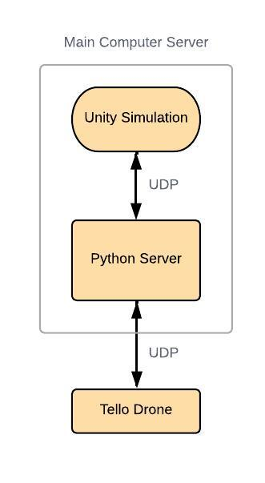
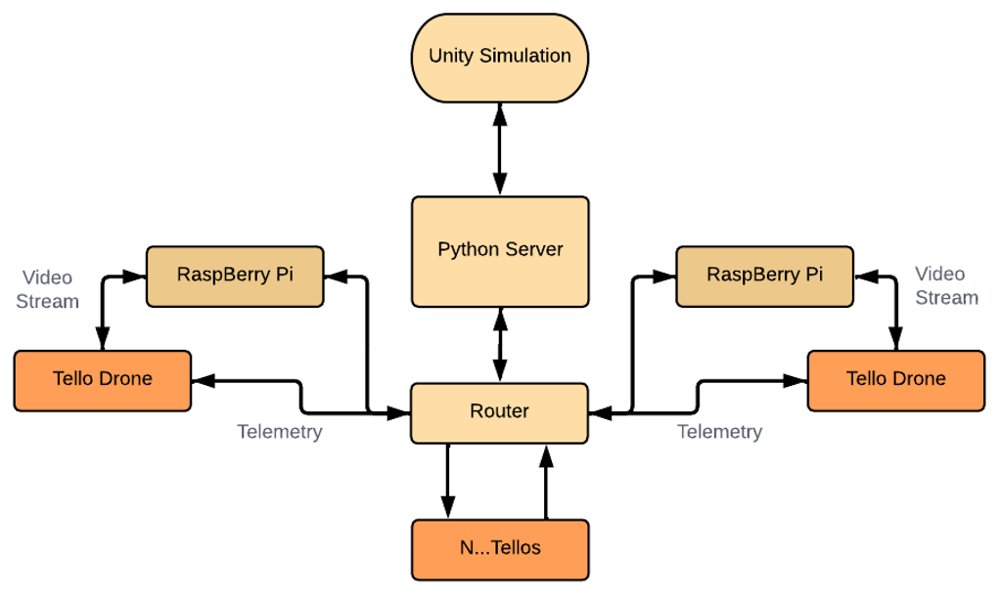
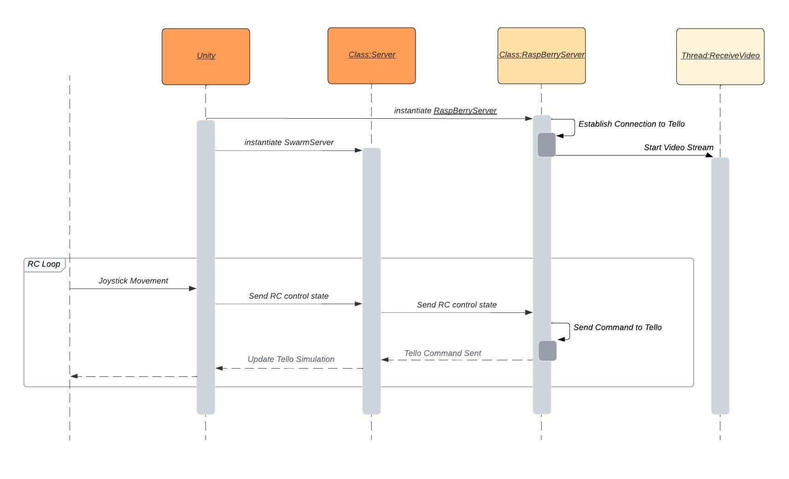

# Tello Digital Twin

The python servers used in the Unity based RoboSim to handle communications with the Tello drone, allowing for the simulataneous control of multiple drones

1. [Requirements](#requirements)
3. [Architecture](#architecture)
4. [Code Structure](#code-structure)
7. [TroubleShooting](#troubleshooting)
8. [External Tools](#external-tools)

# Requirements

> - Python 3.8.0
> - OpenCV 4.7.0 

# Architecture
The drones communicate using UDP based off of the [Tello SDK](https://dl-cdn.ryzerobotics.com/downloads/Tello/Tello%20SDK%202.0%20User%20Guide.pdf) between the python server and the python server communicates using UDP between the server and the Unity Simulation.

**No Video**
- Tello Drones are in AP Mode (refer to SDK) and are connected to the same Router
- The Tello IP addresses are the ones given from the Router using DHCP not manual IP (need to check router for the updated IP addresses)
- Communication is handled directly from the Computer and all the Tello drones
 

**Video**
- Main Tello is in WIFI Mode while the rest are in AP Mode (refer to SDK) and are connected to the same Router which is connected to the same computer
- The Main Tello is connected directly to the computer via WIFI
 

- If Video is required for the different drones simultaneously, need to ensure that each drone is connected to its own seperate computer (Server communicating with different servers/pi)

# Code Structure

The overall Code is designated to two main files, the server.py in pcserver and RaspBerryServer.py in piServer. The server handles the communications with the Unity Project if any while the RaspBerryServer handles the communication with the Tellos.

**UNITY**
- Has RC and digital Twin capabilities
- Server uses UdpComms to communicate with the Unity Project and forwards the data between the multiple RaspBerryServers and the single Unity Project
- Main function Thread within the RaspBerryServer handles the commands received from the Server
- Meant to use RaspBerryServer per Raspberry PI used for drone
- ReceiveVideo function Thread within the RaspBerryServer handles the video processing from the Tello drone

> Tools Scripts are not shown

# TroubleShooting
> Most of the problems stem from unstable or inability to connect to Tello Drones

>Ensure the VideoStreamConfiguration.yaml file is up to date with the Tello IP addresses and details.
### Cannot  Establish connection to Tello Drones ###
- Ensure the Configuration file is accurate
- Ensure All drones are in the correct mode (AP/WIFI) and are connected correctly
- Double Check the connection with the router and interference
- Tello drone Video footage is unstable in noisy aeras with alot of WIFI as the Tello does not dynamically pick a channel
- Use strong router to handle traffic issues
- Video footage cannot be sent in AP Mode

### Drones Drift ###
- Drones will drift easily if battery is low, Tello drone overheating and in high wind conditions
- This is often due to the failure of the drones Visual Positioning System, Can consider placing counter system and VPU state fails during Flight

# External Tools

This Repository uses code based from a few different repositories.

> - DJITelloPy https://github.com/damiafuentes/DJITelloPy/tree/master
> - Tello SDK https://dl-cdn.ryzerobotics.com/downloads/Tello/Tello%20SDK%202.0%20User%20Guide.pdf